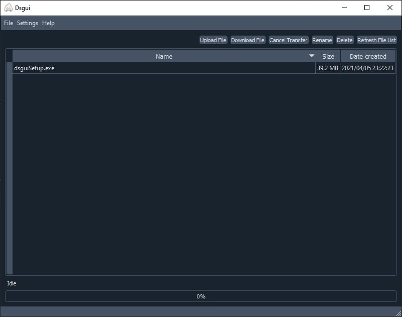

# dsgui: A gui frontend for dscli

Dsgui is a gui frontend for [dscli](https://github.com/darenliang/dsgui),
allowing easy file uploads and downloads though an interactive interface.



## Downloads

Pre-built installers for Windows, macOS and Ubuntu can be found here:

https://github.com/darenliang/dsgui/releases

## Build from source

Dsgui runs on Python 3.5 or 3.6.

#### Create virtual environment

```
python3 -m venv venv
```

#### Activate virtual environment

```
# On Mac/Linux:
source venv/bin/activate
# On Windows:
call venv\scripts\activate.bat
```

#### Install dependencies

```
pip install -r requirements.txt
```

#### Run project

To run project:

```
fbs run
```

To create binary/installer

```
fbs freeze
fbs installer
```

## License

[MIT](https://github.com/darenliang/dsgui/blob/master/LICENSE)